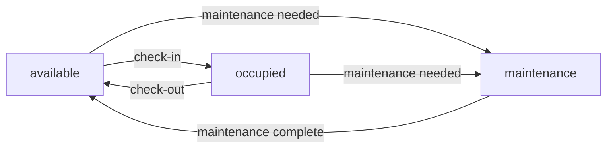
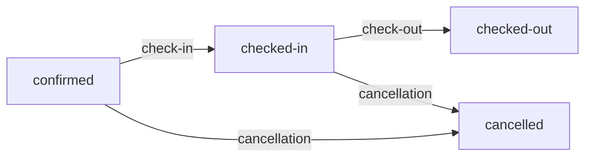

JS Mini Hotel implements several business rules that govern pricing, services, restrictions, and state transitions throughout the reservation lifecycle.

## Room Pricing

Room prices are fixed based on room type and charged per night.

### Price Structure

| Room Type | Price per Night |
|-----------|----------------|
| Single    | €50            |
| Double    | €80            |
| Suite     | €150           |

<Note>
  These prices are defined in the room objects and stored in `~/workspace/source/data/rooms.json`. The base price is multiplied by the number of nights to calculate the room portion of the total cost.
</Note>

### Price Calculation

The total reservation price is calculated as:

```javascript
totalPrice = (pricePerNight × nights) + sum(extras)
```

Where:
- `pricePerNight` is the room's base rate
- `nights` is the number of nights (checkOut - checkIn)
- `sum(extras)` is the total of all extra services (price × quantity for each extra)

---

## Extra Services

Guests can add optional services to their reservations. Services are categorized as daily charges or one-time fees.

### Available Services

<Accordion title="Daily Services">
  These services are charged per day/night of the stay:

  | Service | Price per Day | Example Usage |
  |---------|--------------|---------------|
  | Breakfast | €10 | Charged for each night of stay |
  | Parking | €15 | Charged for each night of stay |
</Accordion>

<Accordion title="One-Time Services">
  These services are charged as a single fee:

  | Service | Price | Description |
  |---------|-------|-------------|
  | Late Check-out | €30 | One-time fee for extended checkout |
  | Early Check-in | €20 | One-time fee for early arrival |
</Accordion>

### Extra Service Structure

Each extra service in the reservation has this structure:

```json
{
  "name": "Breakfast",
  "price": 10,
  "quantity": 5
}
```

<ParamField path="name" type="string">
  Name of the service (e.g., "Breakfast", "Parking", "Late Checkout")
</ParamField>

<ParamField path="price" type="number">
  Price per unit in euros
</ParamField>

<ParamField path="quantity" type="number">
  Number of units (typically equals number of nights for daily services, 1 for one-time services)
</ParamField>

<Warning>
  Extras can be added to reservations using the `addExtras()` function, which automatically recalculates the total price.
</Warning>

---

## Night Restrictions

Reservations must comply with minimum and maximum night limits.

<ParamField path="minimum" type="number" default="1">
  Minimum stay: **1 night**
  
  The check-out date must be at least one day after the check-in date.
</ParamField>

<ParamField path="maximum" type="number" default="14">
  Maximum stay: **14 nights**
  
  Reservations cannot exceed 14 consecutive nights.
</ParamField>

### Implementation

This validation is enforced in `~/workspace/source/utils/validation.js:92-95`:

```javascript
if (getNumberOfNights(checkIn, checkOut) > 14) {
  validation.status = false
  validation.message = 'Solo se puede reservar hasta 14 noches.'
}
```

<Note>
  The minimum of 1 night is implicitly enforced by the date range validation that requires check-out to be after check-in.
</Note>

---

## Room Status Transitions

Rooms transition through different states based on reservations and hotel operations.

### Status Types

Defined in `~/workspace/source/utils/constants.js:9-13`:

```javascript
export const ROOM_STATUS = {
  AVAILABLE: 'available',
  OCCUPIED: 'occupied',
  MAINTENANCE: 'maintenance',
}
```

### Status Flow



<Accordion title="Available">
  **Status:** `"available"`
  
  The room is ready for new reservations and can be booked by guests.
  
  **Transitions to:**
  - `occupied` when a guest checks in
  - `maintenance` when maintenance is required
</Accordion>

<Accordion title="Occupied">
  **Status:** `"occupied"`
  
  The room is currently occupied by a guest with an active reservation.
  
  **Transitions to:**
  - `available` when the guest checks out
  - `maintenance` if issues are reported during stay
  
  **Trigger:** Set during the `checkIn()` function
</Accordion>

<Accordion title="Maintenance">
  **Status:** `"maintenance"`
  
  The room is unavailable due to maintenance, cleaning, or repairs.
  
  **Transitions to:**
  - `available` when maintenance is complete
  
  <Note>
    Rooms in maintenance status cannot be booked and are excluded from availability searches.
  </Note>
</Accordion>

---

## Reservation Status Flow

Reservations progress through a lifecycle from creation to completion or cancellation.

### Status Types

Defined in `~/workspace/source/utils/constants.js:1-7`:

```javascript
export const RESERVATION_STATUS = {
  CONFIRMED: 'confirmed',
  CHECKED_IN: 'checked-in',
  CHECKED_OUT: 'checked-out',
  OCCUPIED: 'occupied',
  CANCELLED: 'cancelled',
}
```

### Status Flow



<Accordion title="Confirmed">
  **Status:** `"confirmed"`
  
  Initial status when a reservation is created. The room is reserved for the specified dates.
  
  **Location:** Active reservations array (`hotel.reservations`)
  
  **Allowed actions:**
  - Add extras
  - Check-in (on or after check-in date)
  - Cancel reservation
  
  **Transitions to:**
  - `checked-in` via `checkIn()` function
  - `cancelled` via `cancelReservation()` function
</Accordion>

<Accordion title="Checked-in">
  **Status:** `"checked-in"`
  
  Guest has arrived and checked into the room. The room status is set to `occupied`.
  
  **Location:** Active reservations array (`hotel.reservations`)
  
  **Validation:**
  - Can only check in from `confirmed` status
  - Check-in date must be today or in the past
  - Reservation must exist
  
  **Transitions to:**
  - `checked-out` via `checkOut()` function
  - `cancelled` via `cancelReservation()` (with potential penalties)
</Accordion>

<Accordion title="Checked-out">
  **Status:** `"checked-out"`
  
  Guest has completed their stay and checked out. Invoice is generated.
  
  **Location:** History array (`hotel.history`)
  
  **Effects:**
  - Room status changed to `available`
  - Reservation moved from `hotel.reservations` to `hotel.history`
  - Invoice generated with full breakdown
  
  **Final state:** No further transitions
</Accordion>

<Accordion title="Cancelled">
  **Status:** `"cancelled"`
  
  Reservation was cancelled before or during the stay.
  
  **Location:** History array (`hotel.history`)
  
  **Cancellation policy:**
  - More than 7 days before check-in: No charge
  - 3-7 days before check-in: 50% of total
  - Less than 3 days before check-in: 100% of total
  
  **Effects:**
  - Room is freed and becomes available
  - Reservation moved to history
  - Penalty calculated based on cancellation policy
  
  **Final state:** No further transitions
</Accordion>

<Warning>
  Reservations can only transition through valid state changes. For example, you cannot check out a reservation that is still in `confirmed` status - it must be `checked-in` first.
</Warning>

### State Validation

The system enforces state transition rules:

- **Check-in** requires status `confirmed`
- **Check-out** requires status `checked-in`
- **Cancellation** allowed from `confirmed` or `checked-in`
- **Adding extras** allowed for `confirmed` and `checked-in` statuses

<Note>
  Once a reservation reaches `checked-out` or `cancelled` status, it is moved to the history array and becomes immutable.
</Note>